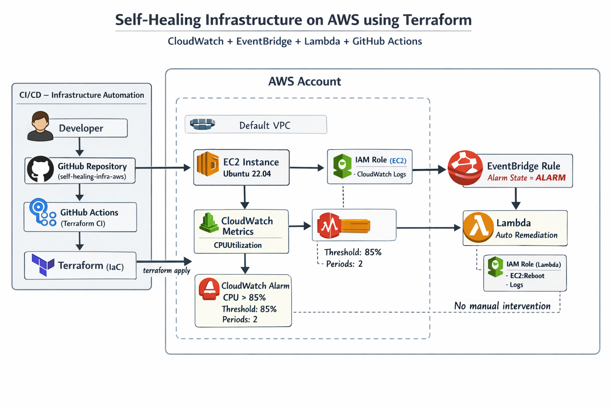

# 🛠️ Self-Healing Infrastructure on AWS (Terraform)

This project demonstrates a **self-healing infrastructure on AWS**, built using **Terraform** and automated with **GitHub Actions**.  
The system continuously monitors EC2 health using **Amazon CloudWatch** and automatically recovers from failures using an **event-driven remediation flow with EventBridge and Lambda** — without any manual intervention.

---

## 📌 Project Status

- ✅ Part 1: Architecture & Failure Design
- ✅ Part 2: Base Infrastructure (Terraform)
- ✅ Part 3: Monitoring & Health Detection
- ✅ Part 4: Auto-Remediation (Self-Healing)
- ✅ Part 5: CI/CD for Infrastructure (GitHub Actions)
- ⏸️ Part 6: Application CI/CD (Planned – intentionally separated)

---

## 🧱 Architecture Diagram



### Architecture Flow
1. Infrastructure is provisioned using **Terraform** via **GitHub Actions**
2. An **EC2 instance** runs inside the default VPC
3. **CloudWatch** monitors EC2 CPU utilization
4. A **CloudWatch Alarm** triggers when CPU exceeds 85%
5. The alarm sends an event to **EventBridge**
6. **EventBridge** invokes a **Lambda function**
7. **Lambda** automatically remediates the issue by rebooting the EC2 instance  
👉 Result: **Self-healing with no manual intervention**

---

## 📂 Repository Structure
```
self-healing-infra-aws/
├── terraform/
│ ├── provider.tf
│ ├── variables.tf
│ ├── ec2.tf
│ ├── security_group.tf
│ ├── iam.tf
│ ├── cloudwatch.tf
│ ├── eventbridge.tf
│ └── lambda.tf
│
├── lambda/
│ └── auto_remediation.py
│
├── .github/
│ └── workflows/
│ └── terraform-ci.yml
│
├── README.md
└── self-healing-infra-aws-architecture.png

```
---


## 🔹 Part 1: Architecture & Failure Design

### Objective
Design failure scenarios **before** building infrastructure.

### Failure Scenarios Considered
- EC2 CPU spike
- Application unresponsiveness
- Manual stress testing

### Design Decisions
- Detection via **CloudWatch metrics**
- Event-driven recovery using **EventBridge**
- Automated remediation using **Lambda**

📌 *This step ensures reliability is designed, not added later.*

---

## 🔹 Part 2: Base Infrastructure (Terraform)

### Components Provisioned
- EC2 instance (Ubuntu 22.04 – Free Tier)
- Security Group
  - HTTP (80) → Public
  - SSH (22) → Restricted to personal IP
- IAM Role for EC2 (no access keys)
- Default VPC

### Best Practices Used
- Infrastructure as Code (IaC)
- Dynamic AMI lookup
- Least-privilege IAM policies
- Variables for reusability

---

## 🔹 Part 3: Monitoring & Health Detection

### Monitoring Configuration
- **CloudWatch Metric:** CPUUtilization
- **Alarm Threshold:** 85%
- **Evaluation Periods:** 2

### Validation
- CPU stress test performed
- Alarm successfully transitioned to `ALARM` state
- Logs verified in CloudWatch

📌 *Demonstrates understanding of real monitoring thresholds.*

---

## 🔹 Part 4: Auto-Remediation (Self-Healing Core)

### Automation Flow
- CloudWatch Alarm → EventBridge Rule
- EventBridge → Lambda Function
- Lambda → EC2 Reboot / Service Recovery

### Security
- Dedicated IAM role for Lambda
- Only required EC2 and logging permissions

### Outcome
- Automatic recovery without SSH or manual action
- Proven self-healing behavior

📌 *This is the core SRE capability of the project.*

---

## 🔹 Part 5: CI/CD for Infrastructure (GitHub Actions)

### Pipeline Capabilities
- Terraform format check
- Terraform validate
- Terraform plan
- Terraform apply

### Benefits
- Git-driven infrastructure changes
- Consistent and repeatable deployments
- No local dependency on developer machine

📌 *Demonstrates DevOps best practices for infrastructure automation.*

---

---

## 🔹 Part 6: Application CI/CD & Health Verification (Completed)

### Objective
Automate application deployment on EC2 and integrate it with the existing self-healing infrastructure.

### Implementation Details
- Application deployment triggered on code changes
- Deployment handled using shell scripting on EC2
- Application/service restart automated after deployment
- Health check performed using HTTP status validation
- Failure during deployment or health check relies on existing monitoring and remediation flow

### Integration with Self-Healing Flow
- Application runs on the same EC2 instance monitored by CloudWatch
- Any abnormal behavior (CPU spike / unresponsive service) is detected automatically
- CloudWatch Alarm → EventBridge → Lambda remediation remains unchanged

📌 *This completes the full DevOps lifecycle: infrastructure provisioning, deployment automation, monitoring, and self-healing.*

---

## 🔐 Security Considerations

- No AWS access keys stored in code or CI/CD
- IAM roles used for EC2 and Lambda instead of credentials
- SSH access restricted to a single trusted IP
- Least-privilege IAM policies enforced
- Deployment automation does not expose secrets

---

## 💰 Cost Optimization

- Entire project runs within AWS Free Tier limits
- Event-driven services (Lambda, EventBridge) incur cost only on execution
- No always-on auxiliary services
- Resources can be fully cleaned up using `terraform destroy`

---

## 🧠 Skills Demonstrated

- Terraform (Infrastructure as Code)
- AWS EC2, IAM, CloudWatch
- EventBridge & Lambda automation
- GitHub Actions for CI/CD
- Application deployment automation
- Monitoring-driven self-healing design
- DevOps & SRE best practices

---

## 🚀 Future Enhancements

- Blue/Green or Rolling application deployments
- Auto Scaling Group integration
- Additional health metrics and alarms
- Remote Terraform state using S3 & DynamoDB
- Notification integration (SNS / Slack)

---

## 📎 Conclusion

This project demonstrates a **complete end-to-end DevOps and SRE workflow**, starting from infrastructure provisioning to automated application deployment, continuous monitoring, and self-healing recovery.

By combining Infrastructure as Code, CI/CD automation, and event-driven remediation, the system achieves high reliability with minimal manual intervention.

---

